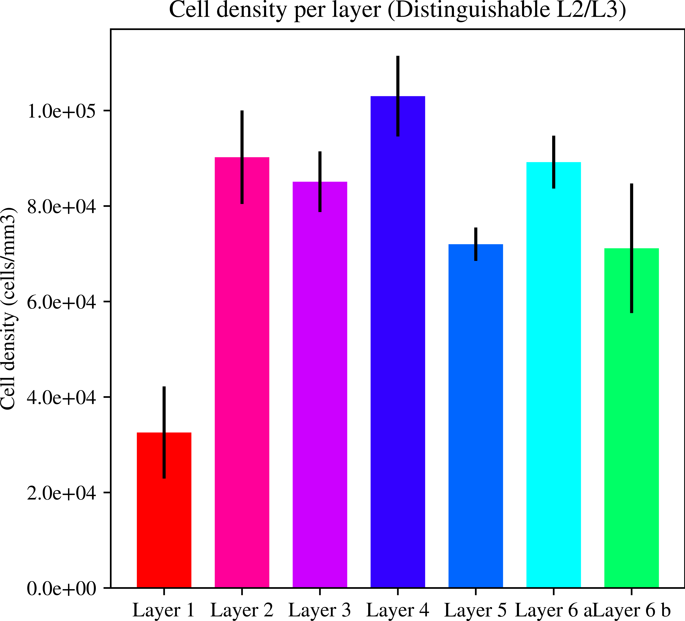
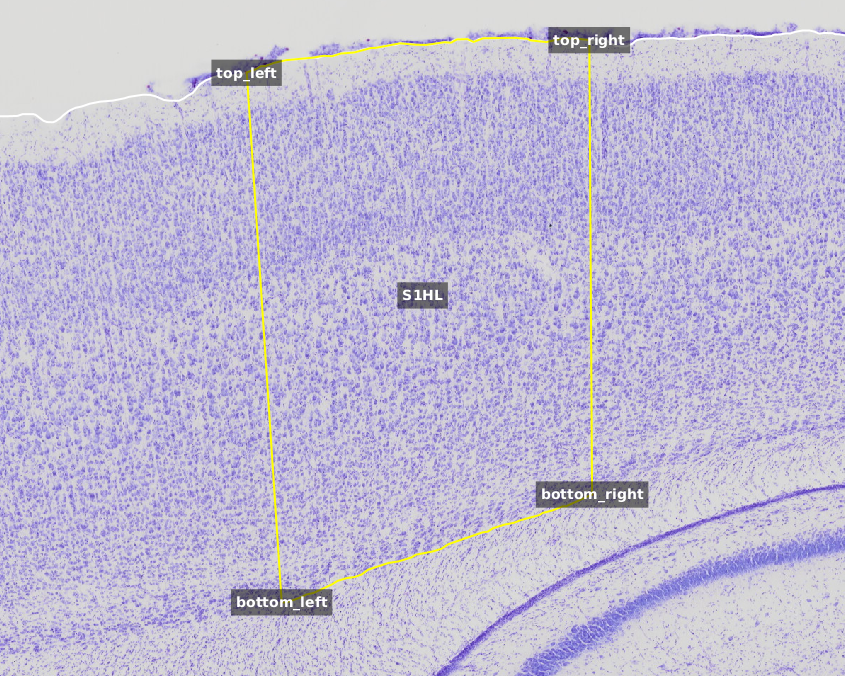

[](https://github.com/jacquemi-bbp/arch/actions)
[](https://github.com/psf/black)
[](https://github.com/jacquemi-bbp/arch/blob/main/LICENSE)
[](https://doi.org/)


# ARCH


Automated Recognition and Classification of Histological layers.
Machine learning for histological annotation and quantification of cortical layers pipeline


## Main usage
This pipeline automatically detects brain cells, classifies them by brain layer and computes cell density. It has been utilized for rat somatosensory cortex Nissl microscopy images, provided by the EPFL LNMC laboratory.

Utilizing images of tissue stained with the classical cresyl violet, imported into  QuPath projects,
alongside a few QuPath annotations made by experts and metadata in a CSV file, this pipeline generates the boundaries of the somatosensory cortex S1HL layers, the cell densities as function of brain depth and the cell densities per brain layers as presented above:
  - The somatosensory cortex S1HL layers boundaries.


-  Cells densities as function of the percentage of depth inside the somatosensory cortex S1HL.


- The per layer cells densities in the somatosensory cortex S1HL.





## The pipeline consists of two main steps:
1. With the assistance of QuPath (a third-party application), perform cell detection and export cell features and annotations.
2. Process the data exported by QuPath in the previous step to compute the boundaries of the layers and cell densities."

## Lexicon
The following definitions will stay in effect throughout the code.
- Annotation: QuPath annotation
- ML: Machine learning
- SSCX: The Somatosensory Cortex
- S1HL: The rat Hindlimb Somatosensory


## Installation
- QuPath: https://qupath.github.io/
- cellpose: https://cellpose.readthedocs.io/en/latest/
- QuPath cellpose extension https://github.com/BIOP/qupath-extension-cellpose


- Python package and its applications.
```shell
$ git clone https://github.com/jacquemi-bbp/arch.git
$ cd arch
$ pip install .
```


### Third parties
#### Python package
- Python third parties libraries are installed during main package installation, listed in the requirements.txt file.


##  Pipeline data inputs
### Data inputs and model used during the cells detection step:
- The images of tissue stained with the classical cresyl violet.
- The following QuPath metadata provided for each image: {Distance to midline:2.35mm, Analyze:True, Rotated:Yes}
- The pre-trained cellpose model that is provided in this package. [cellpose model](cellpose_model/cellpose_residual_on_style_on_concatenation_off_train_2022_01_11_16_14_20.764792)
- QuPath projects (at least one) containing the images requiring processing and the following five annotations: SliceCountour, S1HL, top left, top right, bottom left, and bottom right."




### Data inputs required for cell densitues calculations.
- The images' pixel size : a float number that represents the pixel size of the QuPath input images
- The data outputs generated by the Full_QuPath_script.groovy script:
  - annotations file (json file) that contains:
    - top_left, top_right, bottom_left and bottom_right annotation points
    - S1HL polygon annotation
    - outside_pia annotation

  - detected cells features (csv file) containing the lofflwing features: Image	Object ID	Object type	Name	Classification	Parent	ROI	Centroid X µm	Centroid Y µm	Area µm^2	Length µm	Circul
arity	Solidity	Max diameter µm	Min diameter µm	Hematoxylin: Mean	Hematoxylin: Median	Hematoxylin: Min	Hematoxylin: Max	Hematoxylin: Std.Dev.	DAB: Mean	DAB: Median	DAB: Min	DAB: Max	DAB: Std.Dev.	Distance to annotation with S1HL µm	Distan
ce to annotation with Outside Pia µm	Distance to annotation with SliceContour µm	Delaunay: Num neighbors	Delaunay: Mean distance	Delaunay: Medi
an distance	Delaunay: Max distance	Delaunay: Min distance	Delaunay: Mean triangle area	Delaunay: Max triangle area	Smoothed: 50 µm: Area 
µm^2	Smoothed: 50 µm: Length µm	Smoothed: 50 µm: Circularity	Smoothed: 50 µm: Solidity	Smoothed: 50 µm: Max diameter µm	Smooth
ed: 50 µm: Min diameter µm	Smoothed: 50 µm: Hematoxylin: Mean	Smoothed: 50 µm: Hematoxylin: Median	Smoothed: 50 µm: Hematoxylin: Min	Smoothed: 50 µm: Hematoxylin: Max	Smoothed: 50 µm: Hematoxylin: Std.Dev.	Smoothed: 50 µm: DAB: Mean	Smoothed: 50 µm: DAB: Median	Smooth
ed: 50 µm: DAB: Min	Smoothed: 50 µm: DAB: Max	Smoothed: 50 µm: DAB: Std.Dev.	Smoothed: 50 µm: Distance to annotation with S1HL µm	Smooth
ed: 50 µm: Distance to annotation with Outside Pia µm	Smoothed: 50 µm: Distance to annotation with SliceContour µm	Smoothed: 50 µm: Delaunay: Num
  neighbors	Smoothed: 50 µm: Delaunay: Mean distance	Smoothed: 50 µm: Delaunay: Median distance	Smoothed: 50 µm: Delaunay: Max distanc
e	Smoothed: 50 µm: Delaunay: Min distance	Smoothed: 50 µm: Delaunay: Mean triangle area	Smoothed: 50 µm: Delaunay: Max triangle area	Smooth
ed: 50 µm: Nearby detection counts


# Pipeline
## Steps to compute the cells densities as function of percentage of the S1HL depth processing
- Read the data inputs exported by QuPath and convert them to cartesian point coordinates and shapely polygon.
- Split the S1HL polygon following the S1HL "top and bottom lines" shapes in n polygons (named spitted_polygon)
- Count the number of cells located in each spitted_polygon
- Compute the volume of each spitted_polygon (mm3)
- Compute the cells densities as function of the percentage of the sscx depth
- Export result files


## Steps to compute the densities per S1HL layers
- Read data inputs from QuPath exported files and convert them to cartesian point coordinates and shapely polygon.
- Train a ML model from GroundTruth data produced by some experts
- Use the ML model to predict and affect a layer for each detected cell
- Define a polygon (alphashape) for each layer based on ML prediction
- Count the number of cells located in each layer polygon
- Compute the volume of each layer polygon (mm3)
- Compute the cells densities for each layer
- Export result files


## Pipeline How To

### Step by step:

1. Detect cells and export their features and the QuPath annotations
   - Edit the qupath_scripts/full_quPath_script.groovy and modify the pathes for the following entries to make them corresponding to your environment:
     - modelPath
     - saveFolderPath
     - CountourFinderPath
     - LayerClassiferPath
   - Create the saveFolderPath if it does not already exist.


- Execute the following groovy script inside the QuPath application or via a script thanks to the QuPath script command:
   - qupath_scripts/full_QuPath_script.groovy


2. Convert the QuPath results to pandas dataframes in batch
   - modify the following entries ./Config/batch_convert.ini with your configuration
     - input_detection_directory
     - input_annotation_directory
     - output_directory
     - pixel_size
   - execute the following python script
   ```shell
   $ pyarch convert --config-file-path ./Config/batch_convert.ini
   ```


3. Convert the QuPath project metadata to a pandas dataframe

   - execute the following python script
   ```shell
   $ pyarch convert-qupath-project --qupath-project-path ProjectQuPath.qpproj --output-path /arch/Results
   ```


4. Compute the  cell densities  as function of brain depth
   - modify ./Config/batch_density_depth with your configuration
     - execute the following python script
   ```shell
   $  pyarch density-per-depth --config-file-path ./Config/batch_density_depth.ini
   ```

5. Predict the layers:
   - execute the following python script
   ```shell
   $  pyarchpredict-layer --config-file-path ./Config/batch_layers.ini
   ```

6. Compute the  cell densities  by layer (L2 and L3 merged)
   - modify ./Config/batch_density_layer_merged.ini with your configuration
   - execute the following python script
   ```shell
   $  pyarch density-per-layer --config-file-path ./Config/batch_density_layer_merged.ini
   ```
7. Compute the  cell densities  by layer (L2 and L3 distinguished)
   - modify ./Config/batch_density_layer_distinguish.ini with your configuration
   - execute the following python script
   ```shell
   $  pyarch density-per-layer --config-file-path ./Config/batch_density_layer_distinguish.ini
    ```

8. Prepare dataset for the cell size figures
   - modify ./Config/batch_size with your configuration
   - execute the following python script
   ```shell
   $  pyarch cell_size --config-file-path ./Config/batch_size.ini  
   ```

### In a single pipeline command:
- Edit the configuration file as described above.
- Edit the pipeline.sh script to modify the following inputs:
  - QUPATH_PROJECT_PATH
  - RESULT_PATH
  - FIGURE_PATH
- execute the pipeline.sh command:
```shell
$  pipelne.sh
```
## Figures Howto

### Producing paper's figures
To produce the by hemisphere figures, a csv file is required:
- edit the data/metadata.csv
 
 - execute the following python script 
   ```shell
      python figures_script/cells_density.ini
      python figures_script/cells_size.py CELL_SIZE_OUTPUT_PATH/cells_area.csv output_file_path
   ```


## Funding & Acknowledgment


The development of this software was supported by funding to the Blue Brain Project, a research centre of the École polytechnique fédérale de Lausanne (EPFL), from the Swiss government’s ETH Board of the Swiss Federal Institutes of Technology.


For licence and authors, see `LICENSE.txt` and `AUTHORS.md` respectively.


Copyright © 2022 Blue Brain Project/EPFL


